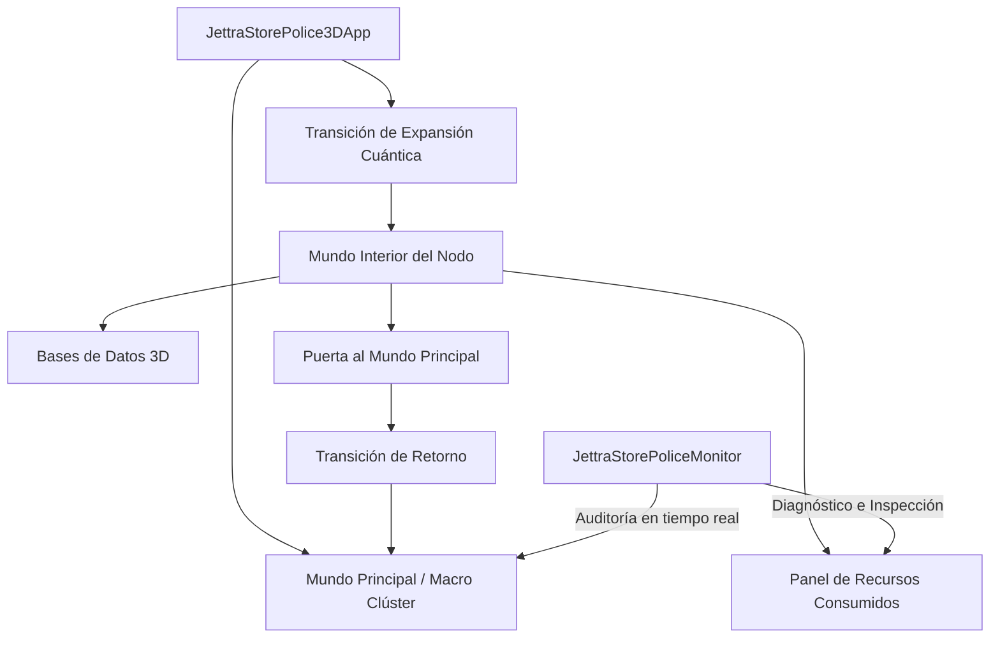

# Manual de Referencia y Arquitectura: JettraStorePolice3D

## 1. Visión General
`JettraStorePolice3D` es el entorno de monitoreo, telemetría y visualización nativo 3D para el ecosistema JettraStore. Combina en una única arquitectura:
* La inteligencia y modelos de agentes autónomos (`io.jettra.core.dl`).
* El motor gráfico nativo 3D acelerado por GPU vía Jaylib-FFM (`io.jettra.core.three.d`).
* La supervisión y auditoría en tiempo real con `JettraStorePoliceMonitor` y `JettraClient`.
* El sistema de **submundos cuánticos** que permite expandir cualquier servidor de la red para visualizar sus bases de datos internas, buckets y consumo de recursos.
* Orquestación de distribución de datos multinodo y visualización de tráfico de partículas inter-nodo.

## 2. Subsistemas Principales y Máquina de Estados de Mundo



### A. Capa de Modelos y Nodos (`ServerNode3D` y `DatabaseInfo3D`)
* Cada servidor mantiene su posición espacial, dimensiones y `BoundingBox` para detección de interacción por rayos de ratón (*raycasting*).
* Aloja una colección de `DatabaseInfo3D`, las cuales detallan el motor de almacenamiento, cantidad de objetos (ej. 3.75M en facturas, 2M en hospital, 3M en ambiental), volumen en disco/RAM y sus buckets especializados.

### B. Máquina de Estados de Mundo (`WorldMode`)
* `MAIN_WORLD`: Representación 3D del clúster con la ciudad, agentes civiles y la entidad `JettraStorePolice` patrullando.
* `EXPANDING_TRANSITION`: Efecto visual de desintegración cuántica y expansión del servidor al hacer clic sobre él.
* `INNER_NODE_WORLD`: Dimensión digital estilizada (cyber-grid Tron) donde orbitan las bases de datos del nodo.
* `EXITING_TRANSITION`: Efecto de vórtice dimensional activado por la Puerta de Retorno.

---

## 3. Topología Multinodo y Distribución de Datos en Clúster

`JettraStorePolice3D` incluye soporte nativo para el protocolo de distribución de datos implementado en JettraStore:

### 3.1 Métodos de Distribución en `JettraStorePoliceMonitor`
El monitor expone las operaciones de distribución que se comunican con el clúster y disparan visualizaciones de partículas en la interfaz 3D:

```java
// 1. Distribuir una base de datos específica y activar animación de transferencia inter-nodo
boolean ok = monitor.clusterDistributed("example_factura_db");

// 2. Distribuir todas las bases de datos registradas hacia todos los nodos del clúster
boolean allOk = monitor.clusterDistributedAll();

// 3. Consultar la tabla de distribución de nodos y bases de datos alojadas
List<Map<String, Object>> topology = monitor.getClusterDistributedInfo();
```

### 3.2 Visualización de Tráfico y Partículas 3D (`triggerNodeTransfer`)
Al ejecutarse una distribución de datos (`clusterDistributed`), el monitor localiza en la escena 3D el nodo primario emisor y los nodos secundarios receptores, e invoca:
```java
triggerNodeTransfer(fromNodeId, toNodeId, "DISTRIBUTE:" + databaseName);
```
Esto genera un flujo animado de camiones de datos cuánticos (`ClusterDataTraffic`) y paquetes luminosos que viajan a través de los enlaces de red inter-nodo, proporcionando retroalimentación visual en tiempo real de la migración de registros.

### 3.3 Reconocimiento de `cluster.multinode.active`
* **Modo Clúster Distribuido (`cluster.multinode.active = on`):**  
  El monitor (`JettraStorePoliceMonitor`) y el cargador de topología (`ClusterConfigLoader`) operan en modo distribuido. La interfaz visualiza el clúster con quórum Raft activo, tráfico inter-nodo de replicación (`ClusterDataTraffic`), estado `[MULTINODO: ON]` en la barra superior HUD y delegación de memoria entre primario y secundarios.
* **Modo Servidor Único / Standalone (`cluster.multinode.active = off`):**  
  Al configurarse en `off`, el monitor reconoce que el sistema de distribución de datos por consenso está desactivado. Todas las operaciones y consultas se resuelven exclusivamente en el servidor local. El HUD notifica `[STANDALONE: OFF]`.

### 3.4 Canal de Eventos en Vivo, Failover Visual y `cluster live`

`JettraStorePolice3D` se conecta directamente al bus de eventos `JettraClusterEventBus` y al canal reactivo de `JettraClient`:

1. **Reacción Visual a Failover y Promoción de Líder (`LEADER_PROMOTED`):**
   * Cuando un nodo primario cae o es detenido, el clúster elige un nuevo líder primario.
   * `JettraStorePoliceMonitor` intercepta el evento `LEADER_PROMOTED`, actualiza dinámicamente el nodo `ServerNode3D` correspondiente asignándole el rol `PRIMARY` y estado Raft `LEADER`.
   * En la escena 3D, el edificio del nuevo nodo primario adquiere el brillo dorado característico del maestro, y el agente canino `k9_beta` (Quórum Raft) reporta la misión con estado informativo de confirmación del nuevo liderazgo.

2. **Detección Visual de Nodos Fuera de Servicio (`NODE_STOPPED` / `NODE_OFFLINE`):**
   * Al recibir una notificación de detención o caída de nodo, el servidor conmuta a estado `OFFLINE` y se renderiza en la escena como inactivo, alertando al centinela `k9_gamma` para proteger las rutas de tráfico residual.

3. **Animación en Tiempo Real de Replicación de Registros:**
   * Los eventos `RECORD_REPLICATED`, `DOCUMENT_REPLICATED` y `DATABASE_DISTRIBUTED` activan instantáneamente el transporte de datos cuánticos (`triggerNodeTransfer`), proyectando partículas y camiones holográficos entre los nodos correspondientes.

4. **Comando y Consulta `cluster live`:**
   * El monitor expone métodos para inspeccionar o transmitir la bitácora de eventos en tiempo real:
     ```java
     // Obtener tabla formateada de los últimos 25 eventos del clúster
     String logLive = monitor.clusterLive(25);
     
     // Obtener lista estructurada de eventos recientes
     List<ClusterLiveEvent> events = monitor.getRecentClusterLiveEvents(50);
     
     // Suscribir callback reactivo
     monitor.subscribeClusterLive(event -> {
         System.out.println("Evento 3D recibido: " + event.type() + " -> " + event.message());
     });
     ```

---

## 4. Gestión de Seguridad y Roles Multimodelo (`UserManager` & `JettraUser`)

`JettraStorePolice3D` incluye un panel completo de administración de seguridad y acceso multibase de datos (`KEY_U` o botón `[👥 USUARIOS]` en la barra lateral):
* **Persistencia Atómica**: Almacenado en `memory/security/users.json` con serialización JSON vía Jackson.
* **Roles Globales de Sistema**:
  * `ADMIN`: Control total de clúster, configuración y seguridad.
  * `OPERATOR`: Administración operativa de nodos y monitoreo de salud.
  * `DEVELOPER`: Ingesta, ejecución de consultas multimodelo y gestión de esquemas.
  * `ANALYST`: Ejecución de consultas analíticas OLAP, vectoriales y grafos.
  * `AUDITOR`: Inspección de bitácoras, cumplimiento y logs de `JettraStorePolice`.
  * `GUEST`: Acceso restringido de solo lectura o demostración.
* **Matriz de Permisos por Base de Datos**: Asignación granular e interactiva de permisos (`NONE`, `READ_ONLY`, `READ_WRITE`, `ADMIN`) para cada base de datos registrada en el servidor (`example_factura_db`, `samples_hospital_db`, `samples_ambiental_db`, etc.).

---

## 5. Explorador Multimodelo de Motores y Registros Paginados (`EngineDataCatalog`)

Accesible directamente mediante **clic derecho sobre cualquier base de datos 3D** en el Mundo Interior del Nodo, mediante el atajo `KEY_E` o con el botón `[🌳 ENGINES / DATOS]`:
* **Estructura en Árbol Jerárquico**:
  * `DOCUMENT`: Documentos JSON/BSON con esquemas flexibles (`facturas`, `clientes`, etc.).
  * `GRAPH`: Redes de grafos, vértices y relaciones ponderadas (`red_comercial`, etc.).
  * `VECTOR`: Embeddings vectoriales de alta dimensión para IA y búsqueda semántica Top-K (`factura_embeddings`).
  * `JAVA_RECORD`: Tipos fuertemente tipados in-memory Java 25 (`FacturaAuditRecord`).
  * `KEYVALUE`: Almacén de pares clave-valor ultrarrápido Off-Heap con expiración (`cache_folios`).
  * `TIMESERIES`: Métricas temporales cronológicas continuas (`volumen_facturacion`).
  * `GEOSPATIAL`: Coordenadas georreferenciadas con indexación espacial (`sucursales_fiscales`).
  * `COLUMNAR`: Almacén columnar OLAP vectorizado para agregaciones masivas (`analitica_fiscal`).
* **Visualización y Paginación**: Navegación fluida por lotes (`◄ ANTERIOR` / `SIGUIENTE ►`), contador de registros totales, marcas temporales, tamaño en bytes y un visor/inspector JSON con sintaxis destacada en tiempo real.

---

## 6. Procedimiento de Ejecución

Para iniciar el entorno 3D con aceleración por GPU en Linux:
```bash
java --enable-native-access=ALL-UNNAMED \
     --enable-preview \
     -jar JettraStorePolice3D-1.0.0-SNAPSHOT-uber.jar
```
Al arrancar, el operador puede alternar entre la vista global de la ciudad, patrullar con los centinelas caninos o ingresar al submundo cuántico de cualquier nodo primario o secundario para supervisar en vivo la integridad de los registros distribuidos.
